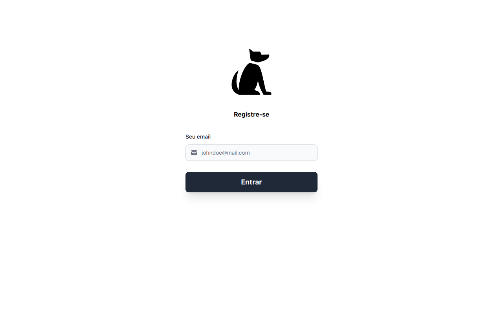

# Desafio Dog Breed

O site pode ser acessado aqui: https://desafio-dog-breed-joaomaranhao.vercel.app/

## Olá! 👋

Esse site é um desafio que foi realizado para a Q9 Tecnologia de acordo com [essas instruções](https://gitlab.com/q9-tecnologia/desafios/mobile/desafio-dogbreed)

## O Desafio

Criar um aplicativo que use a API fornecida para popular uma página com fotos de cachorros.

Para acessar a API, é necessário "cadastrar" um email.

## Meu processo

### Construído com

- NextJS
- TailwindCSS
- Flowbite React

**Espero que gostem!** 🚀